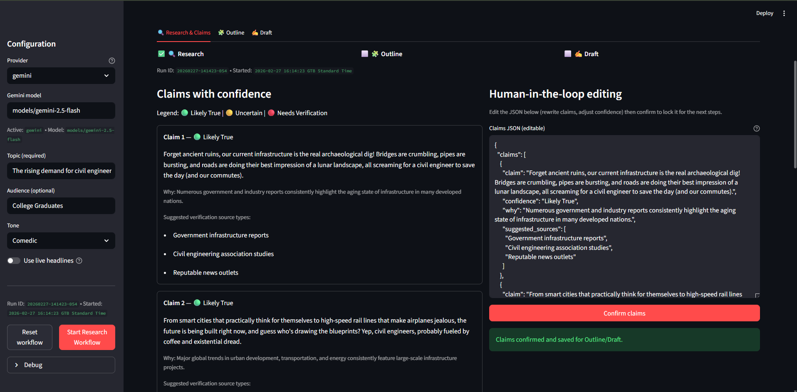
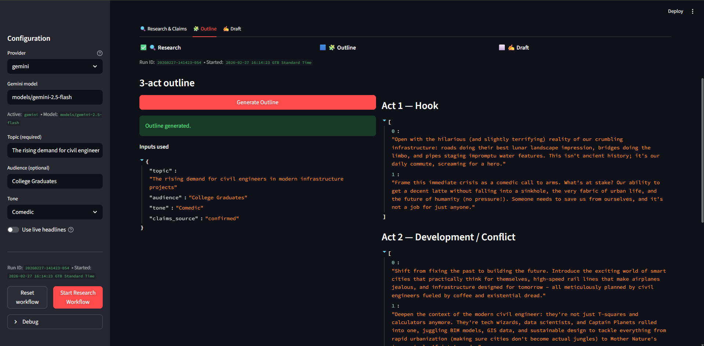
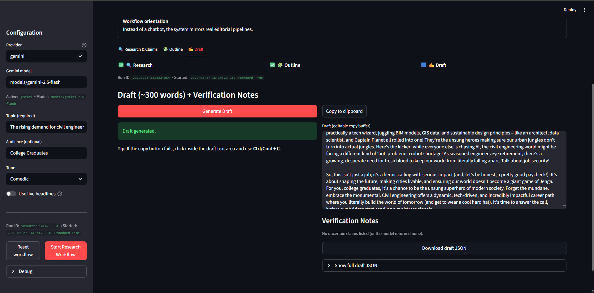

# AI Story Research Assistant (Research → Outline → Draft)

## App Preview

### 1️⃣ Research & Claims
The app first generates research-backed claims with confidence scores and suggested verification sources.



---

### 2️⃣ 3-Act Outline
After confirming the claims, the system generates a structured 3-act outline.



---

### 3️⃣ Draft Generation
Finally, the app generates a ~300 word article draft plus verification notes.



It’s designed to be *workflow‑oriented* (not a chatbot) and supports **human‑in‑the‑loop editing** of the claims JSON before generating the outline and draft.

## Features
- Provider switch: **Gemini** or **OpenAI**
- Claims with confidence labels + “why” + suggested source types
- Editable JSON claims panel + “Confirm claims” gate
- Optional “live headlines” context (RSS)
- Robust JSON extraction/validation + retry on schema errors
- Download buttons for Claims / Outline / Draft (JSON)

## Requirements
- Python 3.10+ recommended
- API key for at least one provider:
  - **Gemini**: `GEMINI_API_KEY`
  - **OpenAI**: `OPENAI_API_KEY`

## Install
```bash
python -m venv .venv
# Windows:
.venv\Scripts\activate
# macOS/Linux:
# source .venv/bin/activate

pip install -r requirements.txt
```

## Run
```bash
streamlit run app_fixed_v3.py
```
## Run Locally

```bash
pip install -r requirements.txt
streamlit run app.py
## Environment variables
### Windows (PowerShell)
```powershell
$env:GEMINI_API_KEY="AIza..."
$env:OPENAI_API_KEY="sk-..."
```

### macOS/Linux
```bash
export GEMINI_API_KEY="AIza..."
export OPENAI_API_KEY="sk-..."
```

## Provider / model settings
In the left sidebar you can choose the provider and model string.

Common examples:
- Gemini: `models/gemini-2.5-flash`
- OpenAI: `gpt-4o-mini` (or any model available to your account)

## Troubleshooting

### `400 API_KEY_INVALID` (Gemini)
- Confirm `GEMINI_API_KEY` is set in your environment.
- Make sure the key is a **Gemini** key (often starts with `AIza...`).
- If needed, create a new key in Google AI Studio and re‑export it.

### `Outline step failed: ...` or `Research step failed: ...` with a KeyError-like string
This usually happens when prompt templates contain unescaped `{}` braces.
(Should be fixed in `app_fixed_v3.py`.)

### JSON parse/validation errors
- Use the “Debug” panel to see the raw model output.
- The app retries once with a corrective prompt. If the model still fails, reduce the complexity of the request (shorter topic, fewer claims) or switch provider.

## Project structure (minimal)
- `app_fixed_v3.py` – Streamlit app
- `requirements.txt` – dependencies

## Tech Stack
- Python
- Streamlit
- Google Gemini API
- Structured JSON prompting
- Human-in-the-loop editing
- `README.md` – this file
## License
Use however you want (add your own license text if you plan to publish).
